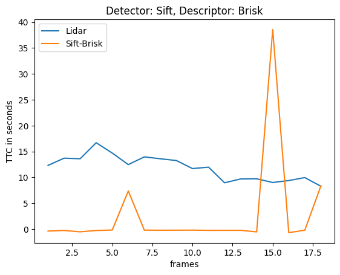

# SFND 3D Object Tracking

Welcome to the final project of the camera course. By completing all the lessons, you now have a solid understanding of keypoint detectors, descriptors, and methods to match them between successive images. Also, you know how to detect objects in an image using the YOLO deep-learning framework. And finally, you know how to associate regions in a camera image with Lidar points in 3D space. Let's take a look at our program schematic to see what we already have accomplished and what's still missing.

In this final project, you will implement the missing parts in the schematic. To do this, you will complete four major tasks: 
1. First, you will develop a way to match 3D objects over time by using keypoint correspondences. 
2. Second, you will compute the TTC based on Lidar measurements. 
3. You will then proceed to do the same using the camera, which requires to first associate keypoint matches to regions of interest and then to compute the TTC based on those matches. 
4. And lastly, you will conduct various tests with the framework. Your goal is to identify the most suitable detector/descriptor combination for TTC estimation and also to search for problems that can lead to faulty measurements by the camera or Lidar sensor. In the last course of this Nanodegree, you will learn about the Kalman filter, which is a great way to combine the two independent TTC measurements into an improved version which is much more reliable than a single sensor alone can be. But before we think about such things, let us focus on your final project in the camera course. 

## Write Up
### FP.1
Implement the method "matchBoundingBoxes", which takes as input both the previous and the current data frames and provides as output the ids of the matched regions of interest (i.e. the boxID property).  Matches must be the ones with the highest number of keypoint correspondences.

My Solution: I first set up a multimap to track the matches in the current and previous image data frames.   After tracking the matches, I iterate through to find the one with the highest number of keypoint matches.

### FP.2
Compute the time-to-collision in seconds for all matched 3D objects using only Lidar measurements from the matched bounding boxes between current and previous frame.

My Solution: The first step is to remove points outside of the lane in which the ego car is for both previous and current frames.  The points were then sorted by y value (so nearest to furthest from the ego car), so that the median point could be found in both frames to calculate the time to collision.

### FP.3
Prepare the TTC computation based on camera measurements by associating keypoint correspondences to the bounding boxes which enclose them.  All matches which satisfy this condition must be added to a vector in the respective bounding box.

My Solution: The first task was to associate keypoints to bounding boxes and add the distance between the current point and the previous point to a vector of differences.  I then calculated the mean of the differences and set a threshold of 1.5 times the mean and if the distance was less than the tolerance, the keypoint was added to its bounding box.

### FP.4
Compute the time-to-collision in seconds for all matched 3D objects using only keypoint correspondences from the matched bounding boxes between current and previous frame.

My Solution: I iterated through the keypoints and calculated the distance between two current points and two previous points.  If the ratio of those distances was within a threshold, then they were added to the distances vector.  This was to try to avoid points that were clearly not "good" matches.  The distances were the sorted to find the median and that point was used to calculate the TTC.

### FP.5
Find examples where the TTC estimate of the Lidar sensor does not seem plausible.  Describe your observations and provide a sound argument why you think this is happening.

The fourth lidar calculation (between frames 4 and 5) seems implausible as the TTC is trending downward, but then jumps up from 13.6 to 16.6 despite the cars seeming to become closer.  The next Another that seems less plausible is calculation 12 (between frames 12 and 13) because while it is trending downward it is a larger step than the others and then goes back up to 9.6 seconds.  The number that is smaller than it ought to have been could have been because more points than normal were a result of dust particles or other detritus that could have been picked up from the lidar making the car seem too close.  The calculation that is larger than it should have been could have been because side view mirrors or other parts of the car or road have been included in the bounding box despite us shrinking it to try to limit this problem.

### FP.6
Run several detector / descriptor combinations and look at the differences in TTC estimation.  Find out which methods perform best and also include several examples where camera-based TTC estimation is way off.  As with Lidar, describe your observations again and also look into potential reasons.

The best 3 detector/descriptor combinations based on these graphs seem to be

Akaze/Akaze
Sift/Sift
Sift/Brief

## Dependencies for Running Locally
* cmake >= 2.8
  * All OSes: [click here for installation instructions](https://cmake.org/install/)
* make >= 4.1 (Linux, Mac), 3.81 (Windows)
  * Linux: make is installed by default on most Linux distros
  * Mac: [install Xcode command line tools to get make](https://developer.apple.com/xcode/features/)
  * Windows: [Click here for installation instructions](http://gnuwin32.sourceforge.net/packages/make.htm)
* OpenCV >= 4.1
  * This must be compiled from source using the `-D OPENCV_ENABLE_NONFREE=ON` cmake flag for testing the SIFT and SURF detectors.
  * The OpenCV 4.1.0 source code can be found [here](https://github.com/opencv/opencv/tree/4.1.0)
* gcc/g++ >= 5.4
  * Linux: gcc / g++ is installed by default on most Linux distros
  * Mac: same deal as make - [install Xcode command line tools](https://developer.apple.com/xcode/features/)
  * Windows: recommend using [MinGW](http://www.mingw.org/)

## Basic Build Instructions

1. Clone this repo.
2. Make a build directory in the top level project directory: `mkdir build && cd build`
3. Compile: `cmake .. && make`
4. Run it: `./3D_object_tracking`.